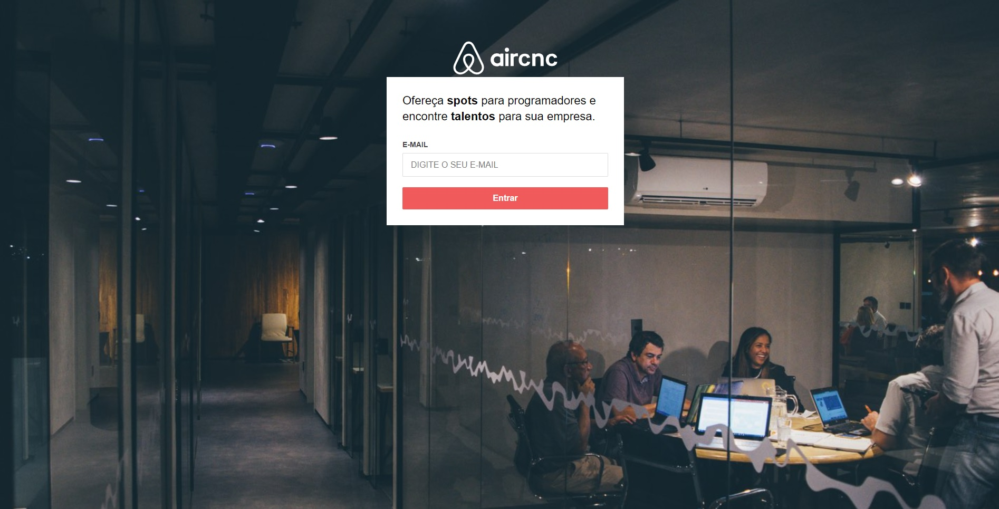
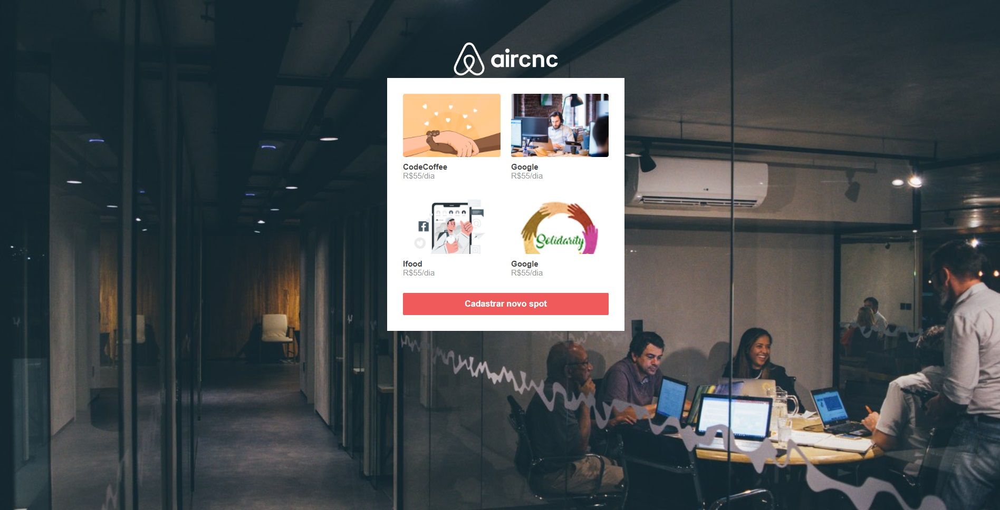
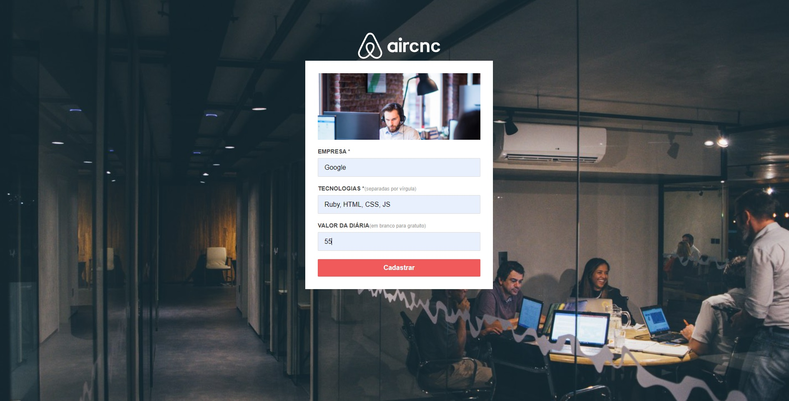

<h1 align ="center">

</h1>
<p align="center">Projeto AirCnC é um projeto para divulgação de alugueis de spot para o setor tecnologico, realizado em umas das semanas da rocketseat.</p>
<p align="center">🚨🚨🚨Sistema desenvolvido para fins educacionais🚨🚨🚨</p>

<p align="center">
 <a href="#pré-requisitos">Pré Requisitos</a> •
 <a href="#rodando-o-mobile">Rodando a aplicação</a> •
 <a href="#tecnologias">Tecnologias</a> •
 <a href="#autor">Autor</a>
</p>

<h1 align="center">
  
  
  
</h1>

### Pré-requisitos

Antes de começar, você vai precisar ter instalado em sua máquina as seguintes ferramentas:
[Git](https://git-scm.com), [Node.js](https://nodejs.org/en/), [MongoDB](https://www.mongodb.com/try/download/community).

Além disto é bom ter um editor para trabalhar com o código como [VSCode](https://code.visualstudio.com/).

### Rodando o Projeto

```bash
# Clone este repositório
$ git clone https://github.com/FernandoHenriqueSouza/AirCnC

# Acesse a pasta do projeto no terminal/cmd
$ cd aircnc

# Instale as dependências
$ yarn

# Executar o Front-end
$ yarn start

# Executar o Back-end
$ yarn dev
```
### Tecnologias

As seguintes ferramentas foram usadas na construção do projeto:

- [NodeJS]
- [ReactJS]
- [MongoDB]
- [HTML]
- [CSS]

### Autor


Made with 💜 by FERNANDO 👋

[](https://www.linkedin.com/in/fernando-henrique-de-souza-180552155/)
=======

